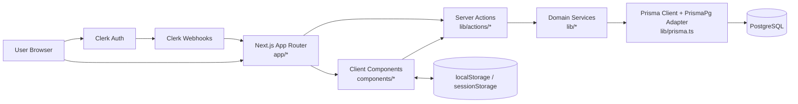
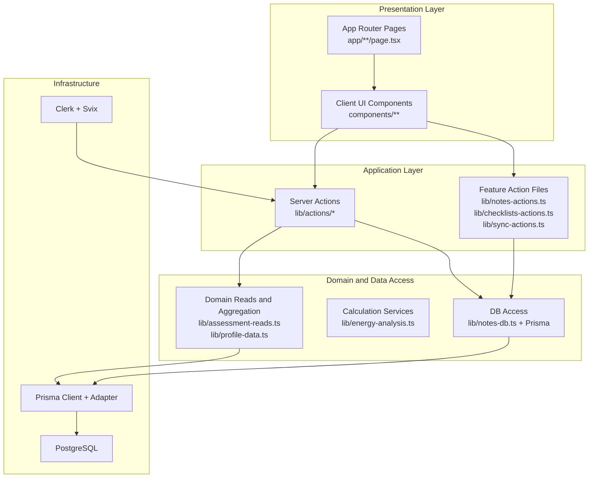
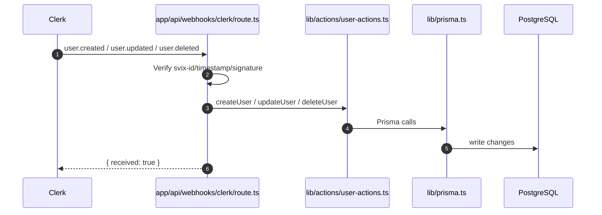
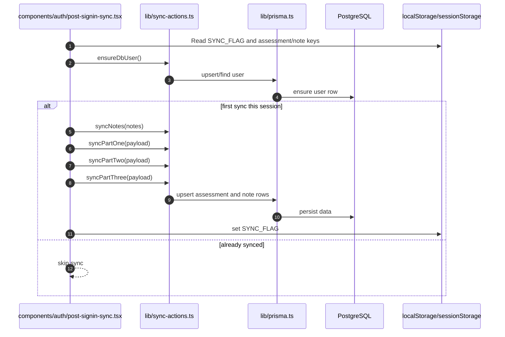
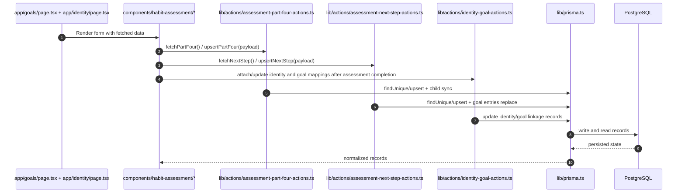
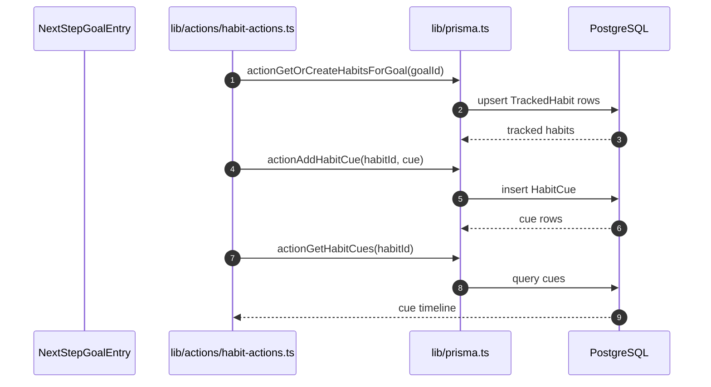
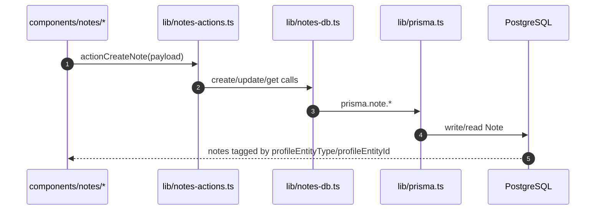
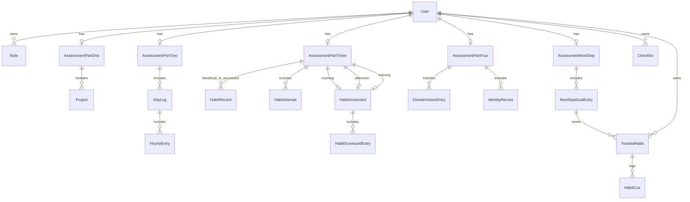

# Atomic Habits Companion Architecture and Data Flows

## Purpose
This document maps the current system architecture and runtime data flows for the app, with direct references to implementation files.

## 1) System Context



### Anchors
- Route and app entry boundaries: [app/layout.tsx](app/layout.tsx)
- Auth webhook ingress: [app/api/webhooks/clerk/route.ts](app/api/webhooks/clerk/route.ts)
- Client sync bridge: [components/auth/post-signin-sync.tsx](components/auth/post-signin-sync.tsx)
- DB adapter and Prisma client: [lib/prisma.ts](lib/prisma.ts)

## 2) Layered Architecture



## 3) Core Runtime Flows

### 3.1 Auth Webhook and User Provisioning



Implementation anchors:
- [app/api/webhooks/clerk/route.ts](app/api/webhooks/clerk/route.ts)
- [lib/actions/user-actions.ts](lib/actions/user-actions.ts)

### 3.2 Post-Sign-In Client Sync (localStorage to DB)



Implementation anchors:
- [components/auth/post-signin-sync.tsx](components/auth/post-signin-sync.tsx)
- [lib/sync-actions.ts](lib/sync-actions.ts)

### 3.3 Assessment Part Four and Next Step Lifecycle



Implementation anchors:
- [lib/actions/assessment-part-four-actions.ts](lib/actions/assessment-part-four-actions.ts)
- [lib/actions/assessment-next-step-actions.ts](lib/actions/assessment-next-step-actions.ts)
- [lib/actions/identity-goal-actions.ts](lib/actions/identity-goal-actions.ts)

### 3.4 Goal to Tracked Habit to Cue Flow



Implementation anchors:
- [lib/actions/habit-actions.ts](lib/actions/habit-actions.ts)
- [components/habits/habit-tracker.tsx](components/habits/habit-tracker.tsx)

### 3.5 Notes by Profile Entity



Implementation anchors:
- [lib/notes-actions.ts](lib/notes-actions.ts)
- [lib/notes-db.ts](lib/notes-db.ts)
- [components/notes/profile-notes-panel.tsx](components/notes/profile-notes-panel.tsx)

### 3.6 Energy Analysis Pipeline

```mermaid
flowchart LR
  P2[AssessmentPartTwo.days[]] --> DL[DayLog[]]
  DL --> HE[HourlyEntry[]]
  HE --> EA[analyzePartTwoEnergy(days)]
  EA --> OUT[EnergyAnalysis aggregate\nTop UP hours\nTop DOWN hours\nActivity patterns]
```

Implementation anchors:
- [lib/energy-analysis.ts](lib/energy-analysis.ts)
- [lib/assessment-reads.ts](lib/assessment-reads.ts)

## 4) Logical Data Model (Prisma)



Schema source of truth:
- [prisma/schema.prisma](prisma/schema.prisma)

## 5) Route and Feature Map

| Route | Main Concern | Typical Component/Action Chain |
|---|---|---|
| /dashboard | Status and navigation hub | page -> dashboard client -> [lib/actions/dashboard-actions.ts](lib/actions/dashboard-actions.ts) |
| /habit-assessment/[id] | Guided assessments | page -> assessment forms -> part actions |
| /goals | Next step system design | page -> goal page component -> [lib/actions/next-step-actions.ts](lib/actions/next-step-actions.ts) |
| /habits and /habits/[habitId] | Habit and cue tracking | page -> habit tracker -> [lib/actions/habit-actions.ts](lib/actions/habit-actions.ts) |
| /notes and /notes/[id] | Rich notes CRUD | page -> notes components -> [lib/notes-actions.ts](lib/notes-actions.ts) |
| /checklists and /checklists/[id] | Checklist storage | page -> checklist UI -> [lib/checklists-actions.ts](lib/checklists-actions.ts) |
| /profile and /settings | Profile and settings | page -> profile components -> profile actions/settings services |
| /api/webhooks/clerk | Auth event ingestion | API route -> user actions -> Prisma |

## 6) Known Structural Notes

1. Commitments route naming is inverted from expected spelling.
- Canonical content page is currently at [app/committments/page.tsx](app/committments/page.tsx).
- [app/commitments/page.tsx](app/commitments/page.tsx) redirects to /committments.

2. Auth schema includes compatibility models while Clerk is the active provider.
- `Account`, `Session`, and `VerificationToken` exist in [prisma/schema.prisma](prisma/schema.prisma).

3. Laws pages are hardcoded as numeric folders.
- Current structure is [app/laws](app/laws) with subfolders 0..4, not a single dynamic segment.

4. localStorage keys are currently literal strings in sync logic.
- Key usage is visible in [components/auth/post-signin-sync.tsx](components/auth/post-signin-sync.tsx).

5. Checklist content is serialized JSON text in the DB.
- `Checklist.content` is stored as `String` in [prisma/schema.prisma](prisma/schema.prisma).

## 7) File and Symbol Index

### Authentication and provisioning
- [app/api/webhooks/clerk/route.ts](app/api/webhooks/clerk/route.ts): `POST`, `extractUserFields`
- [lib/actions/user-actions.ts](lib/actions/user-actions.ts): `createUser`, `updateUser`, `deleteUser`

### Sync bridge
- [components/auth/post-signin-sync.tsx](components/auth/post-signin-sync.tsx): `PostSigninSync`
- [lib/sync-actions.ts](lib/sync-actions.ts): `ensureDbUser`, `syncPartOne`, `syncPartTwo`, `syncPartThree`, `syncNotes`

### Assessments and goals
- [lib/actions/part-four-actions.ts](lib/actions/part-four-actions.ts): `fetchPartFour`, `upsertPartFour`
- [lib/actions/next-step-actions.ts](lib/actions/next-step-actions.ts): `fetchNextStep`, `upsertNextStep`

### Habits and cues
- [lib/actions/habit-actions.ts](lib/actions/habit-actions.ts): tracked habit and cue server actions

### Notes
- [lib/notes-actions.ts](lib/notes-actions.ts): notes server actions
- [lib/notes-db.ts](lib/notes-db.ts): low-level notes persistence helpers

### Domain reads and analysis
- [lib/profile-data.ts](lib/profile-data.ts): profile snapshots and commitments reads
- [lib/assessment-reads.ts](lib/assessment-reads.ts): assessment retrieval
- [lib/energy-analysis.ts](lib/energy-analysis.ts): pure energy aggregation pipeline

### Schema
- [prisma/schema.prisma](prisma/schema.prisma): full data model

## 8) Read This First for Future Changes

When adding features, align changes to this path:
1. Route/page entry in app.
2. Client UI in components.
3. Server action in lib/actions.
4. Domain/data utility in lib.
5. Prisma model and migration updates in prisma.

This keeps feature ownership explicit and data flow traceable end-to-end.
